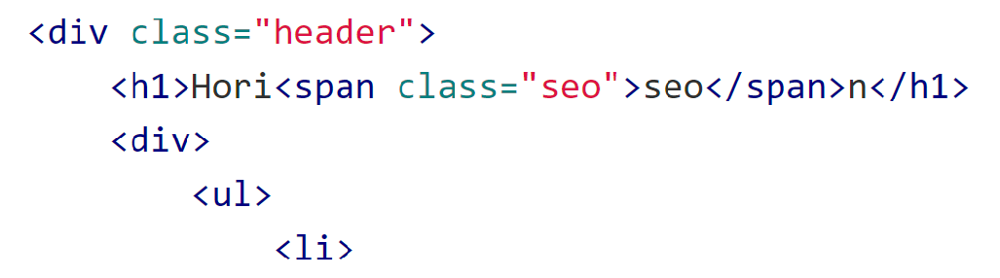
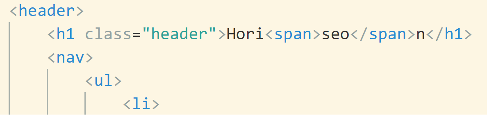

# marketaccessibility

##

- I should probably learn a few new things for the future career, hence the attempt at producing a good homework file.
- Original website code was refractored to remove redundant code and to consolidate CSS into smaller, more compact file.

##

- The request from a client was to refractor the code from original website without chaning the original look or the functions of the website.

##

- Example of consolidations:

